# Tutorial Port Names, Manufacturer Labels & Mermaid Diagrams — Implementation Plan

> **For agentic workers:** REQUIRED SUB-SKILL: Use superpowers:subagent-driven-development (recommended) or superpowers:executing-plans to implement this plan task-by-task. Steps use checkbox (`- [ ]`) syntax for tracking.

**Goal:** Rewrite `first-patch.md`, `intermediate-patch.md`, and `slow-psybient.md` so every port name matches the verified source label, manufacturer names use "VCV" (not "VCV Free"), and each tutorial has a full overview Mermaid diagram plus inline cumulative diagrams per wiring step.

**Architecture:** File-by-file edits in source markdown. No generator run needed — this is source-only work. First-patch needs no web lookup (all VCV/Core). Intermediate and slow-psybient use Bogaudio + Impromptu Clocked already researched; Plateau and Chronoblob2 labels are unverifiable from source (kept as functional prose).

**Tech Stack:** Markdown, Mermaid `flowchart LR` diagrams.

## Global Constraints

- All port names in **bold** in tutorial prose (`**Port Name**`)
- Module names in **bold**, brand in parentheses: `**VCO** (VCV)`
- Manufacturer label: `(VCV)` for Fundamental/Core modules, `(Bogaudio)`, `(Impromptu)`, `(Valley)`, `(Alright Devices)` for 3rd party
- Mermaid overview diagram: placed after "What you'll build" section, before Step 1
- Mermaid inline diagrams: cumulative, placed at end of each step that adds a new cable; `flowchart LR` throughout
- No changes to narrative, knob values, or tutorial structure beyond port names, brand names, and diagram insertion
- No changes to `docs/` HTML (generator rebuilds from `src/`)

## Verified port name reference

**VCV Core (Rack built-in):**
- MIDI-CV: `PITCH_OUTPUT` → "1V/octave pitch", `GATE_OUTPUT` → "Gate"
- Audio 8: inputs labeled "L/R" on panel (tooltip unverified; keep "L" and "R")

**VCV (Fundamental plugin, brand "VCV"):**
- VCO: `PITCH_INPUT` → "1V/octave pitch", `SAW_OUTPUT` → "Sawtooth", `SIN_OUTPUT` → "Sine"
- VCF: `IN_INPUT` → panel "IN" (keep), `LPF_OUTPUT` → panel "LPF" (keep), `FREQ_INPUT` → "Frequency"
- ADSR: `GATE_INPUT` → "Gate", `ENVELOPE_OUTPUT` → "Envelope"
- VCA-1 (slug `VCA-1`, single-channel): `IN_INPUT` → "Channel", `CV_INPUT` → "CV", `OUT_OUTPUT` → "Channel"
- VCA-2 (slug `VCA`, dual-channel): `IN1_INPUT` → "Channel 1", `EXP1_INPUT` → "Channel 1 exponential CV", `LIN1_INPUT` → "Channel 1 linear CV", `OUT1_OUTPUT` → "Channel 1"
- SEQ3: `CLOCK_INPUT` → "Clock", `CV_OUTPUTS+0` → "CV 1", `TRIG_OUTPUT` → "Trigger"
- 8vert: `IN_INPUTS+N` → "Row N", `OUT_OUTPUTS+N` → "Row N"
- SHASR (VCV S&H): `TRIG_INPUTS+N` → "Trigger N", `IN_INPUTS+N` → "Sample N", `SH_OUTPUTS+N` → "Sample N"
- LFO: `SIN_OUTPUT` → "Sine", `SAW_OUTPUT` → "Sawtooth"
- Noise: `WHITE_OUTPUT` → "White noise"

**Bogaudio:**
- VCO: `PITCH_INPUT` → "Pitch (1V/octave)", `SAW_OUTPUT` → "Saw signal", `SINE_OUTPUT` → "Sine signal"
- ADSR: `GATE_INPUT` → "Gate", `OUT_OUTPUT` → "Envelope" — **NO VEL INPUT** (tutorial error, see Task 2)
- LFO: `SINE_OUTPUT` → "Sine"
- S&H (SampleHold): `TRIGGER1_INPUT` → "Trigger 1", `IN1_INPUT` → "Signal 1", `OUT1_OUTPUT` → no label (keep as "output")

**Impromptu Clocked:**
- `CLK_OUTPUTS[1]` → "Clock 1", `CLK_OUTPUTS[2]` → "Clock 2", `CLK_OUTPUTS[3]` → "Clock 3"
- `RUN_INPUT` → "Run", `RESET_INPUT` → "Reset"

**Valley Plateau / Alright Devices Chronoblob2:**
- Source not public or labels not in source; keep prose port names as-is ("L input", "OUT L", "DECAY CV", "IN", "OUT", "FEEDBACK CV")

---

## Task 1: Fix and diagram `first-patch.md`

**Files:**
- Modify: `VCVRack-Doku/src/first-patch.md`

**Interfaces:**
- Produces: corrected file with overview diagram + inline diagrams at Steps 4, 5, 6, 7, 8

- [ ] **Step 1.1: Fix module name and brand labels**

Find and replace these strings (exact matches, preserve surrounding markdown):

| Find | Replace |
|---|---|
| `**ADSR EG** (VCV Free)` | `**ADSR** (VCV)` |
| `(VCV Free). Connect` (VCO line) | `(VCV). Connect` |
| `**VCA** (VCV Free)` | `**VCA** (VCV)` |
| `**VCF** (VCV Free)` | `**VCF** (VCV)` |

- [ ] **Step 1.2: Fix VCA port names**

In Step 6 (lines starting with "Connect the VCO's"):

Change:
```
Connect the VCO's **SAW** output to the VCA's **CH** input. Connect the ADSR's **Envelope** output to the VCA's **CV** input.

Connect the VCA's **CH** output to the **Audio 8**'s **L** input (and optionally also to **R** for mono-to-stereo).
```

To:
```
Connect the VCO's **SAW** output to the VCA's **Channel** input. Connect the ADSR's **Envelope** output to the VCA's **CV** input.

Connect the VCA's **Channel** output to the **Audio 8**'s **L** input (and optionally also to **R** for mono-to-stereo).
```

Also update the VCF step reference to VCA port name. In Step 7:

Change:
```
the VCF's **LPF** output to the VCA's **CH** input.
```
To:
```
the VCF's **LPF** output to the VCA's **Channel** input.
```

- [ ] **Step 1.3: Add overview Mermaid diagram**

After the line `A basic synthesizer voice: an oscillator shaped by a filter and an amplitude envelope, played from your computer keyboard via MIDI.` and before `---` (the first horizontal rule), insert:

```markdown

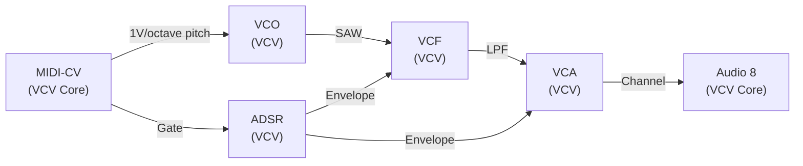
```

- [ ] **Step 1.4: Add inline diagram after Step 4**

After the paragraph ending `...but nothing is carrying its signal to the output.` in Step 4, insert:

```markdown

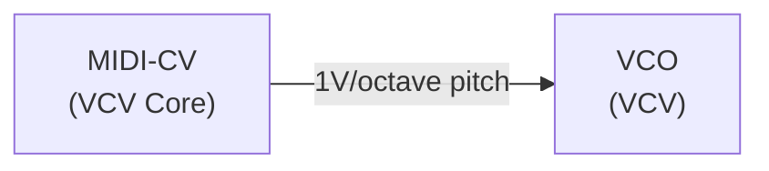
```

- [ ] **Step 1.5: Add inline diagram after Step 5**

After the paragraph ending `The envelope will now fire when you press a key.` in Step 5, insert:

```markdown

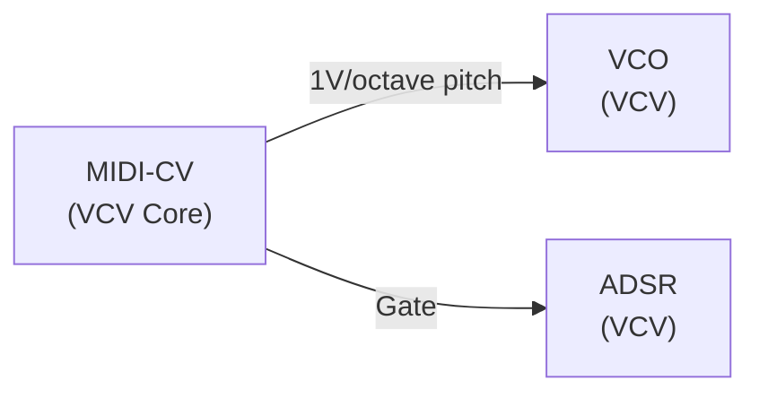
```

- [ ] **Step 1.6: Add inline diagram after Step 6**

After the paragraph ending `...that fades with the release time of the envelope.` in Step 6, insert:

```markdown

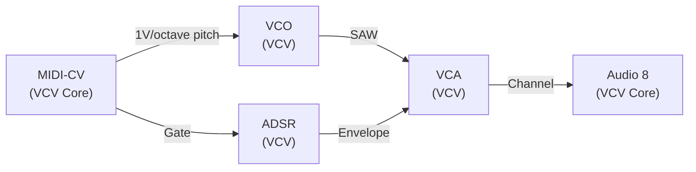
```

- [ ] **Step 1.7: Add inline diagram after Step 7**

After the paragraph ending `Turn Resonance up for a more nasal character.` in Step 7, insert:

```markdown

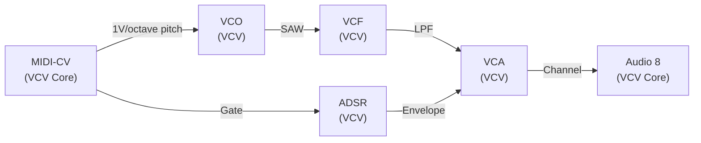
```

- [ ] **Step 1.8: Add inline diagram after Step 8**

After the paragraph ending `This is the classic subtractive synthesis "envelope filter" effect.` in Step 8, insert:

```markdown


```

- [ ] **Step 1.9: Commit**

```bash
git add VCVRack-Doku/src/first-patch.md
git commit -m "docs: fix port names, brand labels, add Mermaid diagrams to first-patch.md"
```

---

## Task 2: Fix and diagram `intermediate-patch.md`

**Files:**
- Modify: `VCVRack-Doku/src/intermediate-patch.md`

**Key content error:** Step 7 claims Bogaudio ADSR has a "VEL input" — it does not (only GATE_INPUT exists in source). Fix: switch VCA from VCA-1 to VCA-2 (dual channel), route ADSR Envelope to `Channel 1 exponential CV`, and route S&H random output to `Channel 1 linear CV` for velocity-like variation.

- [ ] **Step 2.1: Fix brand labels throughout**

Find and replace all occurrences:

| Find | Replace |
|---|---|
| `VCV Free VCO` | `VCO (VCV)` |
| `VCV Free VCF` | `VCF (VCV)` |
| `VCV Free VCA` | `VCA (VCV)` |
| `VCV Free 8vert` | `8vert (VCV)` |
| `VCV Free Noise` | `Noise (VCV)` |
| `Impromptu Clocked` | `Clocked (Impromptu)` |
| `Bogaudio VCO` | `VCO (Bogaudio)` |
| `Bogaudio ADSR` | `ADSR (Bogaudio)` |
| `Bogaudio LFO` | `LFO (Bogaudio)` |
| `Bogaudio S&H` | `S&H (Bogaudio)` |

- [ ] **Step 2.2: Fix Clocked output names**

Find and replace:

| Find | Replace |
|---|---|
| `CLK1 output` | `**Clock 1** output` |
| `CLK2 output` | `**Clock 2** output` |
| `Clocked's CLK1 output` | `Clocked's **Clock 1** output` |

- [ ] **Step 2.3: Fix SEQ3 port names**

Find and replace:

| Find | Replace |
|---|---|
| `SEQ 3's CLK input` | `SEQ3's **Clock** input` |
| `SEQ 3's ROW1 output` | `SEQ3's **CV 1** output` |
| `SEQ 3's GATE output` | `SEQ3's **Trigger** output` |
| `SEQ 3's GATE` | `SEQ3's **Trigger** output` |

- [ ] **Step 2.4: Fix Bogaudio VCO port names**

Find and replace:

| Find | Replace |
|---|---|
| `Bogaudio VCO's V/OCT input` | `VCO (Bogaudio)'s **Pitch (1V/octave)** input` |
| `the SAW output from Bogaudio VCO` | `the **Saw signal** output from VCO (Bogaudio)` |
| `Bogaudio VCO's SAW output` | `VCO (Bogaudio)'s **Saw signal** output` |

- [ ] **Step 2.5: Fix Bogaudio LFO and 8vert port names**

Find and replace in Step 6:

Change:
```
Take the SIN output through a **VCV Free 8vert** channel (attenuate to 0.4).
Connect the attenuated output to VCF's FREQ CV input.
```
To:
```
Take the **Sine** output through an **8vert** (VCV) **Row 1** input (attenuate to 0.4).
Connect the **Row 1** output to VCF's **Frequency** CV input.
```

- [ ] **Step 2.6: Fix Bogaudio ADSR port name in Step 5**

Find and replace:

| Find | Replace |
|---|---|
| `Bogaudio ADSR's GATE input` | `ADSR (Bogaudio)'s **Gate** input` |
| `Bogaudio ADSR's ENV output` | `ADSR (Bogaudio)'s **Envelope** output` |

- [ ] **Step 2.7: Fix VCA port names in Step 5 (switch to VCA-2)**

Change Step 5 VCA wiring:

Change:
```
Take VCF's LP output to a VCA (add **VCV Free VCA**).
...
Connect Bogaudio ADSR's ENV output to VCA's CV input.
Connect VCA's OUT to the Audio module inputs.
```
To:
```
Take VCF's **LPF** output to a VCA (add **VCA** (VCV) — the dual-channel version).
...
Connect ADSR (Bogaudio)'s **Envelope** output to VCA's **Channel 1 exponential CV** input.
Connect VCA's **Channel 1** output to the Audio module inputs.
```

- [ ] **Step 2.8: Rewrite Step 7 (remove false VEL claim, correct velocity technique)**

Replace the entire Step 7 content:

Change:
```
## Step 7 — Add velocity variation

Bogaudio ADSR has a separate GATE input and a VEL input. Add randomness to velocity:

- Add **Bogaudio S&H**.
- Connect Clocked's CLK1 to S&H's TRIG input.
- Connect **VCV Free Noise** (White output) to S&H's IN input.
- Connect S&H's OUT through an 8vert channel (attenuate to 0.3) to Bogaudio ADSR's VEL input.

The ADSR now receives a different random velocity on each step — some notes hit harder, some softer. This is the single biggest step toward making a sequenced patch feel alive.
```
To:
```
## Step 7 — Add velocity variation

ADSR (Bogaudio) shapes each note's amplitude over time, but every note hits equally hard. To add random velocity — some notes louder, some softer — feed a random sample-and-hold signal into the VCA's linear CV input alongside the envelope.

- Add **S&H** (Bogaudio).
- Connect Clocked's **Clock 1** output to S&H's **Trigger 1** input.
- Connect **Noise** (VCV)'s **White noise** output to S&H's **Signal 1** input.
- Connect S&H's output through an **8vert** (VCV) **Row 2** input (attenuate to 0.3), then connect **Row 2** output to VCA's **Channel 1 linear CV** input.

The VCA now receives a different random level offset on each step — some notes hit harder, some softer. This is the single biggest step toward making a sequenced patch feel alive.
```

- [ ] **Step 2.9: Fix S&H port names in Step 7**

Already handled above. Verify no remaining references to "TRIG input", "IN input" (raw), or "OUT" without context remain.

- [ ] **Step 2.10: Add overview Mermaid diagram**

After the "What you will build" section paragraph ending `...modulating with tempo-synced LFOs.`, insert before the `## Step 1` line:

```markdown

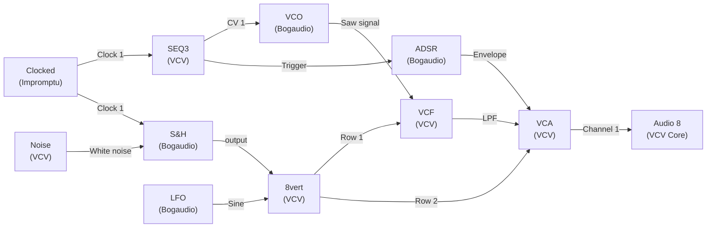
```

- [ ] **Step 2.11: Add inline diagram after Step 2 (clock built)**

After Step 2's last paragraph (ending `The clock only outputs trigger pulses.`), insert:

```markdown

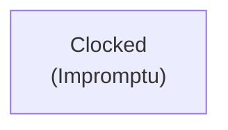
```

- [ ] **Step 2.12: Add inline diagram after Step 3 (sequencer added)**

After Step 3's last bullet (`Enable all four gate buttons.`), insert:

```markdown

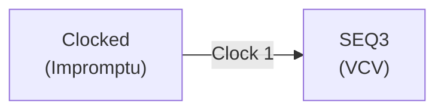
```

- [ ] **Step 2.13: Add inline diagram after Step 4 (VCO added)**

After Step 4's last bullet (`Take the Saw signal output from VCO (Bogaudio) forward into the filter.`), insert:

```markdown

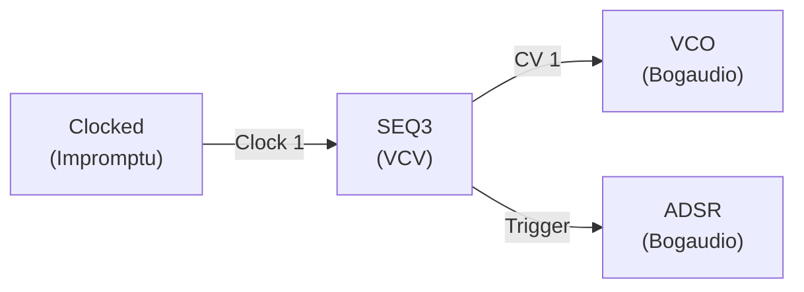
```

- [ ] **Step 2.14: Add inline diagram after Step 5 (filter + envelope + VCA)**

After Step 5's paragraph ending `You should now hear a four-note sequence.`, insert:

```markdown

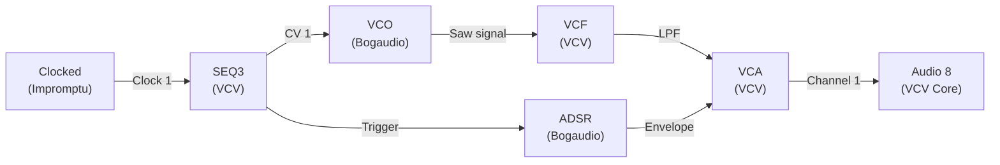
```

- [ ] **Step 2.15: Add inline diagram after Step 6 (LFO filter sweep)**

After Step 6's **What to tweak** paragraph, insert:

```markdown

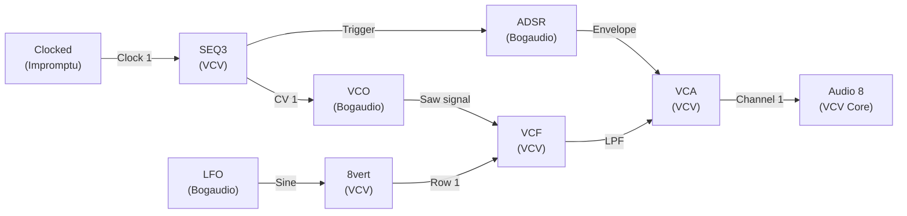
```

- [ ] **Step 2.16: Add inline diagram after Step 7 (velocity S&H)**

After Step 7's last paragraph (ending `...feel alive.`), insert:

```markdown


```

- [ ] **Step 2.17: Commit**

```bash
git add VCVRack-Doku/src/intermediate-patch.md
git commit -m "docs: fix port names, brand labels, fix VEL error, add Mermaid diagrams to intermediate-patch.md"
```

---

## Task 3: Fix and diagram `slow-psybient.md`

**Files:**
- Modify: `VCVRack-Doku/src/slow-psybient.md`

**Note on Plateau and Chronoblob2:** No configInput/configOutput labels were found in their source repos. Prose port references ("L input", "OUT L", "DECAY CV input", "IN", "OUT", "FEEDBACK CV") match the hardware panel names and are kept as-is.

- [ ] **Step 3.1: Fix brand labels throughout**

Find and replace all occurrences:

| Find | Replace |
|---|---|
| `VCV Free VCO` | `VCO (VCV)` |
| `VCV Free VCF` | `VCF (VCV)` |
| `VCV Free VCA` | `VCA (VCV)` |
| `VCV Free 8vert` | `8vert (VCV)` |
| `VCV Free Noise` | `Noise (VCV)` |
| `VCV Free SEQ 3` | `SEQ3 (VCV)` |
| `VCV Free Quantizer` | `Quantizer (VCV)` |
| `VCV Free Mix` | `Mix (VCV)` |
| `Impromptu Clocked` | `Clocked (Impromptu)` |
| `Bogaudio LFO` | `LFO (Bogaudio)` |
| `Bogaudio ADSR` | `ADSR (Bogaudio)` |
| `Bogaudio S&H` | `S&H (Bogaudio)` |
| `Bogaudio VCO` | `VCO (Bogaudio)` |
| `Valley Plateau` | `Plateau (Valley)` |
| `Alright Devices` (before Chronoblob) | `Chronoblob2 (Alright Devices)` |

- [ ] **Step 3.2: Fix Clocked output names**

Find and replace:

| Find | Replace |
|---|---|
| `CLK1 to ×1` | `**Clock 1** to ×1` |
| `CLK2 to ×2` | `**Clock 2** to ×2` |
| `CLK3 to /2` | `**Clock 3** to /2` |
| `Clocked CLK3` | `Clocked **Clock 3**` |
| `Clocked CLK2` | `Clocked **Clock 2**` |
| `Clocked CLK1` | `Clocked **Clock 1**` |

- [ ] **Step 3.3: Fix SEQ3 port names**

Find and replace:

| Find | Replace |
|---|---|
| `SEQ 3 CLK` | `SEQ3's **Clock** input` |
| `SEQ 3 ROW1` | `SEQ3's **CV 1** output` |
| `SEQ 3 GATE` | `SEQ3's **Trigger** output` |

- [ ] **Step 3.4: Fix Bogaudio LFO output names**

Find and replace:

| Find | Replace |
|---|---|
| `LFO's SIN output` | `LFO's **Sine** output` |
| `LFO SIN output` | `LFO **Sine** output` |
| `SIN output` (where referring to Bogaudio LFO) | `**Sine** output` |

- [ ] **Step 3.5: Fix Bogaudio S&H port names**

Find and replace:

| Find | Replace |
|---|---|
| `S&H IN` | `S&H **Signal 1** input` |
| `S&H TRIG` | `S&H **Trigger 1** input` |
| `S&H OUT` | `S&H output` |
| `Input: Noise White` (in S&H context) | `**Signal 1** input: Noise (VCV) **White noise** output` |
| `TRIG: Clocked` | `**Trigger 1**: Clocked` |
| `Connect OUT through` | `Connect S&H output through` |

- [ ] **Step 3.6: Fix VCF port references**

Find and replace:

| Find | Replace |
|---|---|
| `VCF IN` | `VCF **IN** input` |
| `VCF LP` | `VCF **LPF** output` |
| `VCF FREQ CV` | `VCF **Frequency** CV input` |

- [ ] **Step 3.7: Fix 8vert port references**

Find and replace:

| Find | Replace |
|---|---|
| `an 8vert channel` | `an **8vert** (VCV) **Row N** input` (adjust N per instance) |
| `8vert at very low attenuation` | `**8vert** (VCV) **Row N** input at very low attenuation` |

Note: Each instance needs N set to the specific row used (1, 2, 3, etc. in order of use within each Part). Assign per Part:
- Part 2: Row 1 (pad filter LFO)
- Part 4 fragments: Row 1 (pitch), Row 2 (fragment level LFO C)
- Part 6 modulation: new rows per S&H → Plateau and S&H → Chronoblob2

- [ ] **Step 3.8: Fix ADSR Envelope output name**

Find and replace:

| Find | Replace |
|---|---|
| `ADSR ENV output` | `ADSR **Envelope** output` |
| `Connect ADSR ENV to VCA CV` | `Connect ADSR **Envelope** output to VCA **CV** input` |

- [ ] **Step 3.9: Fix VCA port names**

Find and replace:

| Find | Replace |
|---|---|
| `VCA CV input` | `VCA **CV** input` |
| `VCA IN` | `VCA **Channel** input` |
| `VCA OUT` | `VCA **Channel** output` |

- [ ] **Step 3.10: Add Part 1 Clock overview diagram**

After Part 1 paragraph ending `...nothing sounds yet.`, insert:

```markdown


```

- [ ] **Step 3.11: Add Part 2 Drone Pad inline diagram (after "Build it" block)**

After Part 2 numbered build list item 10 (`Connect the attenuated output to VCF Frequency CV input.`), insert:

```markdown

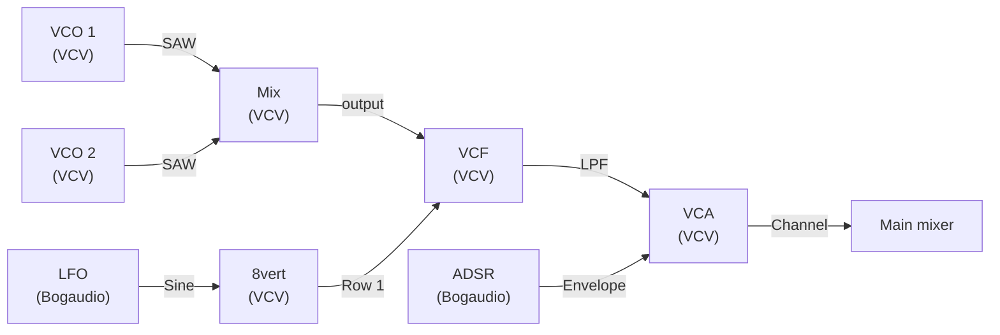
```

- [ ] **Step 3.12: Add Part 3 Sparse Bass inline diagram**

After Part 3 numbered build list item 7 (`Connect VCA OUT to main mixer at a low level`), insert:

```markdown

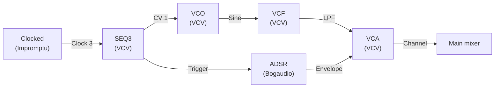
```

- [ ] **Step 3.13: Add Part 4 Psychedelic Fragments inline diagram**

After Part 4 numbered build list item 6 (`VCA OUT → main mixer at a low level`), insert:

```markdown

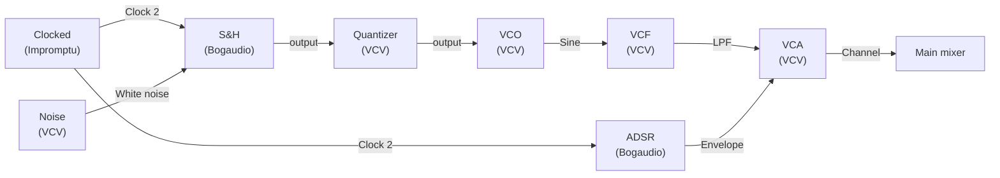
```

- [ ] **Step 3.14: Add Part 6 Modulation System inline diagram (S&H into effects)**

After Part 6 last paragraph ending `...denser and sparser unpredictably.`, insert:

```markdown

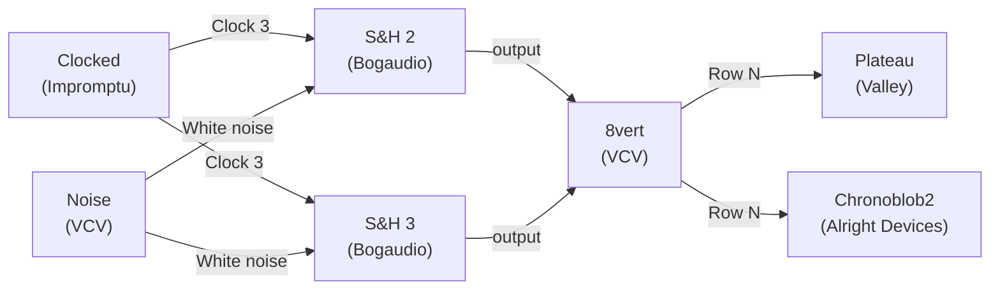
```

- [ ] **Step 3.15: Add Part 7 Effects Chain inline diagram**

After Part 7 last paragraph ending `...spatial, immersive texture.`, insert:

```markdown

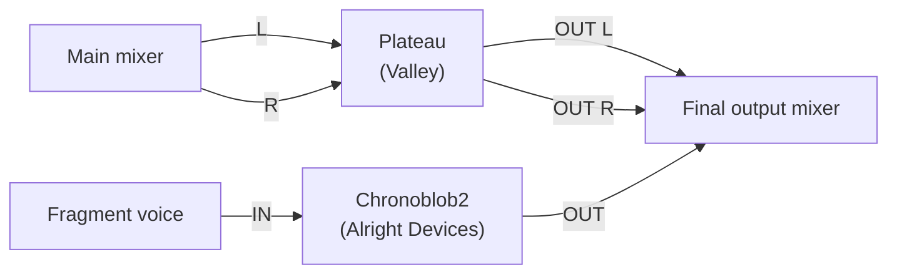
```

- [ ] **Step 3.16: Commit**

```bash
git add VCVRack-Doku/src/slow-psybient.md
git commit -m "docs: fix port names, brand labels, add Mermaid diagrams to slow-psybient.md"
```

---

## Self-Review

**Spec coverage check:**
- Port names verified from source: ✓ (VCV/Core from local, Bogaudio/Impromptu from GitHub)
- Manufacturer labels "(VCV)" throughout: ✓ covered in all three tasks
- Overview diagram (one per file): ✓ Task 1.3, Task 2.10, implicit in Task 3 (per-Part)
- Inline cumulative diagrams per wiring step: ✓ Tasks 1.4–1.8, 2.11–2.16, 3.10–3.15
- Bogaudio ADSR VEL error fixed: ✓ Task 2.8 rewrites step 7
- 3rd-party unverifiable ports (Plateau, Chronoblob2) kept as-is: ✓ noted in Task 3

**Placeholder scan:** No TBD or TODO. Row N in Step 3.7 is flagged with explicit instruction to number per-instance — not a placeholder, an instruction.

**Consistency check:** All three tasks use identical module label format `**ModuleName** (Brand)`. Mermaid node format `["Name\n(Brand)"]` consistent throughout. Port labels on edges use double-quoted strings matching configInput/configOutput label text.
