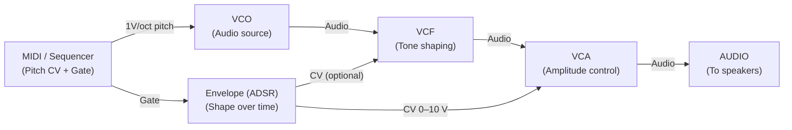

# How a Patch Works

A patch is a signal chain. Audio starts at a source, travels through processors, and arrives at your audio output. Along the way, control voltages shape how the audio sounds moment to moment. This page walks through a complete voice — the path a single note takes from oscillator to speaker — and explains why each stage exists.

---

## The signal chain

---

## Stage 1 — The source: VCO

Every patch needs a sound source. The VCO (Voltage-Controlled Oscillator) generates continuous audio-rate waveforms: sine, triangle, sawtooth, square. Each waveform has a different timbral character — sawtooth is bright and full of harmonics, sine is pure and soft.

The VCO tracks pitch via its 1V/oct input. Connect a MIDI module's V/Oct output, or a sequencer's CV output, and the VCO will play the right note. Without a pitch CV, the VCO plays at a fixed frequency set by its Frequency knob.

An LFO can modulate the VCO's FM input for vibrato. The Sync input resets the waveform phase on each trigger, useful for hard-sync sounds.

---

## Stage 2 — Tone shaping: VCF

Raw oscillator waveforms are often too bright or harsh on their own. The VCF (Voltage-Controlled Filter) cuts or emphasizes frequency content. A lowpass filter is the most common choice: it passes everything below the cutoff frequency and attenuates everything above. Turning the cutoff down makes the sound warmer and darker.

Resonance (also called Q) emphasizes the frequencies around the cutoff point. At high resonance the filter begins to ring at its cutoff frequency — useful for acid bass sounds and sweeping effects.

The filter becomes expressive when its cutoff is modulated by an envelope. Patching the ADSR's output to the VCF's Freq CV input causes the filter to open and close with each note — a bright attack that softens as the sound decays.

---

## Stage 3 — Amplitude shaping: VCA

Without a VCA, the oscillator would play constantly at full volume. The VCA (Voltage-Controlled Amplifier) controls the level of the audio signal moment to moment. On its own, the VCA is silent — you need to open it with a CV signal.

The most common approach is to connect an envelope's output to the VCA's CV input. When a gate arrives, the envelope attacks up to full voltage, holds, then releases when the gate closes. The VCA follows, giving the sound its characteristic shape: a transient, a body, a fade.

---

## Stage 4 — Timing and modulation: ADSR

The ADSR (Attack, Decay, Sustain, Release) is not in the audio path — it lives in the control path. It generates a voltage contour when triggered by a gate.

- **Attack** — how quickly the envelope rises from 0 to peak when the gate opens
- **Decay** — how quickly it falls from peak to the sustain level
- **Sustain** — the level held while the gate remains open
- **Release** — how quickly it falls back to 0 after the gate closes

One envelope can control both the VCA and the VCF simultaneously, giving coordinated amplitude and timbral movement. Use two envelopes with different settings if you want the filter to open faster than the amplitude, or close more slowly.

---

## Stage 5 — Output

The AUDIO module connects VCV Rack to your computer's audio output. Connect your final audio signal — usually the output of a VCA or mixer — to the L (and optionally R) input of the AUDIO module. Set the sample rate and device in the module's panel, then press Run in the toolbar.

Keep levels below clipping. The Scope module can help you visualise signal levels before the output.

---

## Expanding the patch

The basic voice above is just the start. Common additions:

Adding an **LFO** modulating the VCF cutoff creates a rhythmic filter sweep without any notes being played.

Adding a **Mixer** before the AUDIO module lets you blend multiple voices, add a noise source for percussion, or mix a dry and wet signal from an effect.

Adding a **Delay** or **Reverb** after the VCA places effects in the audio chain, where they process the already-shaped signal.

Adding a **Sequencer** to drive the pitch CV turns a single-note test into a melodic pattern.

---

## Where to go next

- [Your First Patch](first-patch.md) — build this signal chain step by step
- [Patching Use Cases](anwendungsfaelle.md) — expand on this foundation
- [Signal Flow & Concepts](mental-model.md) — deeper background on voltages and module types
- [Fundamental Modules](fundamental-modules.md) — reference for VCO, VCF, VCA, ADSR

---

*Version: 2026-06-17.*
