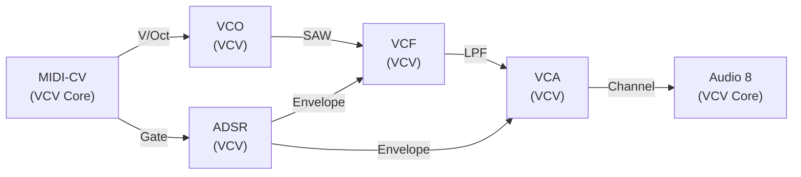
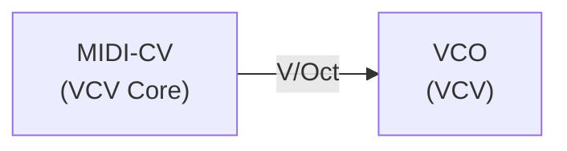
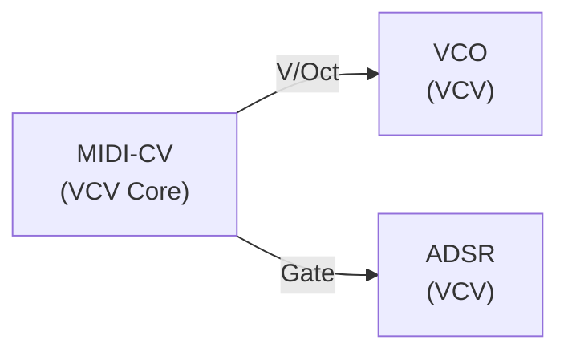
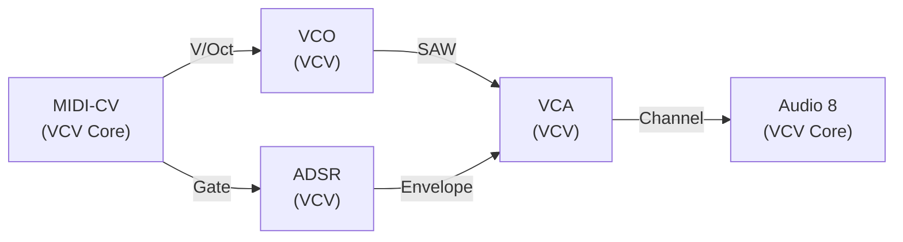
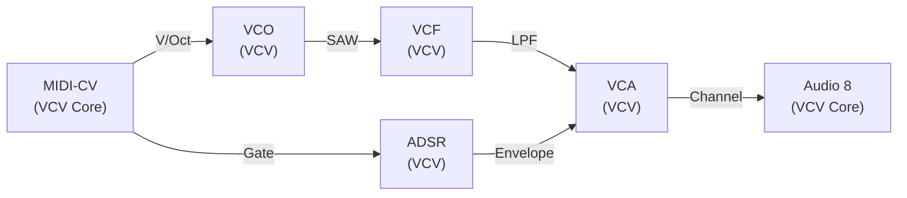
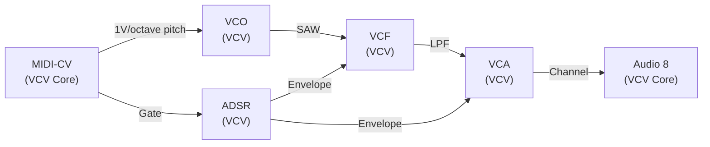

# Your First Patch

This tutorial takes you from a blank VCV Rack canvas to a working, playable sound using only the modules included with VCV Rack Free. It should take about ten minutes.

---

## What you'll build

A basic synthesizer voice: an oscillator shaped by a filter and an amplitude envelope, played from your computer keyboard via MIDI.

---

## Step 1 — Open a new patch

Launch VCV Rack. If a patch is already open, choose **File > New** to start fresh.

---

## Step 2 — Add the AUDIO module

Press **Space** to open the module browser. Search for **Audio 8** or just **Audio**. Add the **Audio 8** module (VCV Core). This is your connection to your speakers.

Click the device display on the module and select your audio output device. If you don't see one, check that your audio interface or built-in speakers are connected and not in use by another application.

**[⬇ Download patch — Step 2](first-patch-step2.vcv)**

---

## Step 3 — Add MIDI to CV

Open the browser again and add **MIDI to CV** (VCV Core). Click its display and select your MIDI keyboard, or select **Computer keyboard** to use your computer's typing keys as a piano.

You now have a V/Oct output (pitch) and a Gate output on this module.

**[⬇ Download patch — Step 3](first-patch-step3.vcv)**

---

## Step 4 — Add VCO

Add **VCO** (VCV). Connect the **MIDI to CV**'s **V/Oct** output to the VCO's **PITCH** input. You've just told the oscillator to track your keyboard.

Run the engine (click the power button in the toolbar) and press a key. Nothing sounds yet — the oscillator is running, but nothing is carrying its signal to the output.

**[⬇ Download patch — Step 4](first-patch-step4.vcv)**

---

## Step 5 — Add ADSR

Add **ADSR** (VCV). Connect **MIDI to CV**'s **Gate** output to the ADSR's **Gate** input. The envelope will now fire when you press a key.

Still silent — the envelope fires when you press a key but there is no VCA carrying the signal through yet.

**[⬇ Download patch — Step 5](first-patch-step5.vcv)**

---

## Step 6 — Add VCA

Add **VCA** (VCV). Connect the VCO's **SAW** output to the VCA's **Channel** input. Connect the ADSR's **Envelope** output to the VCA's **CV** input.

Connect the VCA's **Channel** output to the **Audio 8**'s **L** input (and optionally also to **R** for mono-to-stereo).

Press a key. You should now hear a sawtooth note that fades with the release time of the envelope.

**[⬇ Download patch — Step 6](first-patch-step6.vcv)**

---

## Step 7 — Add VCF

Add **VCF** (VCV). Insert it between the VCO and the VCA: disconnect the VCO from the VCA, then connect the VCO's **SAW** output to the VCF's **IN** input, and the VCF's **LPF** output to the VCA's **Channel** input.

Turn the VCF's **Cutoff** knob to a lower value — around 9 o'clock. You should now hear a darker sound — the VCF is rolling off the high frequencies. Turn Resonance up for a more nasal character.

**[⬇ Download patch — Step 7](first-patch-step7.vcv)**

---

## Step 8 — Modulate the filter

Connect a second cable from the ADSR's **Envelope** output to the VCF's **Freq** input. Turn the VCF's Freq CV knob (small knob next to the Freq input) up to about 3 o'clock.

You should now hear the filter open briefly on each note attack, then close back down as the envelope falls. This is the classic subtractive synthesis "envelope filter" effect.

**[⬇ Download patch — Step 8](first-patch-step8.vcv)**

---

## Step 9 — Save your patch

Press **Ctrl+S** and save the patch somewhere you'll find it.

---

## Where to go next

- [How a Patch Works](how-a-patch-works.md) — understand what each connection is doing
- [Patching Use Cases](patching-use-cases.md) — extend this patch into a bassline or add effects
- [Fundamental Modules](fundamental-modules.md) — full parameter reference for every module you used here

---

*Version: 2026-06-17.*
