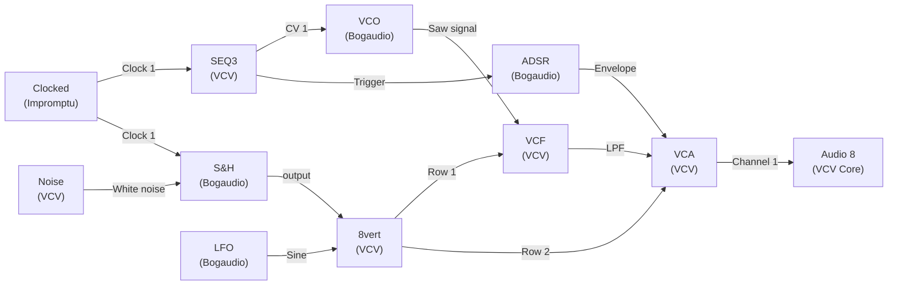
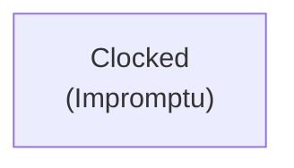
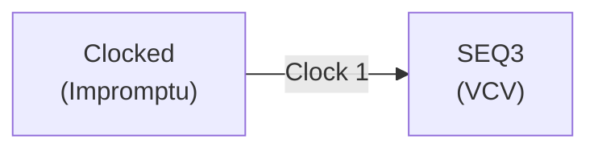
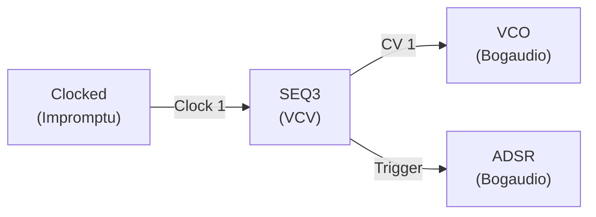
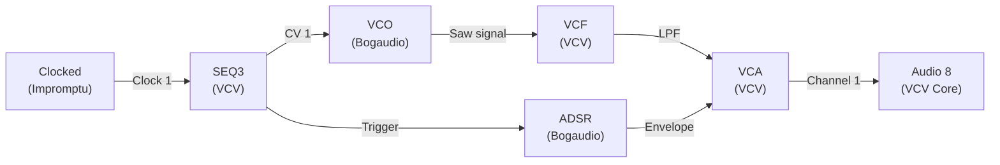
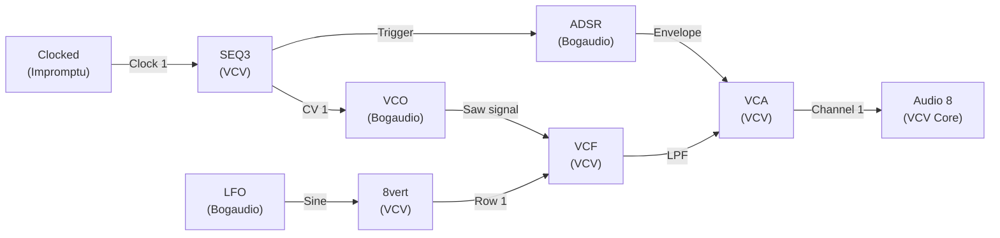

# Beyond the Basics: Your First Third-Party Patch

This tutorial assumes you have worked through [Your First Patch](first-patch.md) and are comfortable with the basic VCO → VCF → VCA → Output signal chain. Here you will install your first free third-party plugins, build a more expressive voice using Bogaudio, and add a proper clock and sequencer using Impromptu Clocked. The result is a self-playing melodic patch that runs without a keyboard.

## What you will build

A four-step melodic sequence through a filter-swept lead voice with velocity variation and an automated tempo-synced LFO filter sweep. The patch plays itself and introduces three new concepts: installing plugins, using a clock module, and modulating with tempo-synced LFOs.

## Step 1 — Install the plugins

Before building, install two free plugins from the VCV Library:

1. Open VCV Rack and go to Library (top menu) → VCV Library.
2. Search for **Bogaudio** and click Subscribe.
3. Search for **Impromptu Modular** and click Subscribe.
4. Restart VCV Rack. The new modules will appear in the module browser.

## Step 2 — Build the clock

Add **Clocked (Impromptu)** from the module browser (search "Clocked"). This is your master tempo source.

- Set BPM to 120.
- **Clock 1** output: set ratio to ×1 (quarter notes — the main beat).
- **Clock 2** output: set ratio to ×4 (sixteenth notes — for a future hi-hat if you want one).
- Press RUN to start the clock.

You will hear nothing yet — the clock only outputs trigger pulses.

## Step 3 — Add a sequencer

Add **SEQ3** (VCV) from the module browser.

- Connect Clocked's **Clock 1** output to SEQ3's **Clock** input.
- Set STEPS to 4 (four-step loop).
- Set the four step knobs to C3, E3, G3, A3 (these are approximately -1V, -0.75V, -0.5V, -0.25V — tune by ear against the VCO you add next).
- Enable all four gate buttons.

## Step 4 — Add the voice

Add **VCO (Bogaudio)** (search "Bogaudio VCO" in the browser). This is a more flexible oscillator than VCV's VCO.

- Connect SEQ3's **CV 1** output to VCO (Bogaudio)'s **Pitch (1V/octave)** input.
- Connect SEQ3's **Trigger** output to the next step's input (keep reading).
- Take the **Saw signal** output from VCO (Bogaudio) forward into the filter.

## Step 5 — Add filter and envelope

Add **VCF (VCV)** and **ADSR (Bogaudio)**.

- Connect VCO (Bogaudio)'s **Saw signal** output to VCF's **IN** input.
- Take VCF's **LPF** output to a VCA (add **VCA** (VCV) — the dual-channel version).
- Connect SEQ3's **Trigger** output to ADSR (Bogaudio)'s **Gate** input.
- Connect ADSR (Bogaudio)'s **Envelope** output to VCA's **Channel 1 exponential CV** input.
- Connect VCA's **Channel 1** output to the Audio module inputs.

Set the ADSR: Attack 10ms, Decay 200ms, Sustain 0.6, Release 300ms. You should now hear a four-note sequence.

**What to tweak first:** Adjust the SEQ3 step knob voltages while the sequence runs to change the pitches. The four notes will drift through whatever intervals you set — use the VCO's built-in tuner display or tune by ear.

## Step 6 — Add a tempo-synced filter sweep

This is the step that makes the patch feel professional rather than static.

Add **LFO (Bogaudio)**.

- Set LFO (Bogaudio)'s FREQ to match your tempo: at 120 BPM, one beat per second = 2 Hz.
- Take the **Sine** output through an **8vert** (VCV) **Row 1** input (attenuate to about 0.4).
- Connect the **Row 1** output to VCF's **Frequency** CV input.

Now the filter opens and closes in time with the beat, giving the sequence a rhythmic breathing quality.

**What to tweak:** Change the LFO rate. Halving it to 1 Hz gives a two-beat filter sweep — the filter opens slowly over two beats and closes again. Setting it very slow (0.1 Hz) produces a gradual sweep over ten seconds. Each rate changes the groove completely.

## Step 7 — Add velocity variation

ADSR (Bogaudio) shapes each note's amplitude over time, but every note hits equally hard. To add random velocity — some notes louder, some softer — feed a random sample-and-hold signal into the VCA's linear CV input alongside the envelope.

- Add **S&H (Bogaudio)**.
- Connect Clocked's **Clock 1** output to S&H's **Trigger 1** input.
- Connect **Noise** (VCV)'s **White noise** output to S&H's **Signal 1** input.
- Connect S&H's output through an **8vert** (VCV) **Row 2** input (attenuate to 0.3), then connect **Row 2** output to VCA's **Channel 1 linear CV** input.

The VCA now receives a different random level offset on each step — some notes hit harder, some softer. This is the single biggest step toward making a sequenced patch feel alive.

## What you have learned

This patch introduced: installing free plugins, Clocked (Impromptu) as a master tempo source, Bogaudio's more flexible VCO and ADSR, tempo-synced LFO filter modulation, and random velocity using S&H. These techniques apply to every patch you build from here on.

## Where to go next

- [Sequencers](sequencer.md) — deeper sequencer options including phrase chaining
- [LFO](lfo.md) — more modulation techniques
- [Sample & Hold](sample-hold.md) — all the ways S&H adds randomness
- [Slow Psybient](slow-psybient.md) — a more complex patch using similar techniques
- [Patching Use Cases](patching-use-cases.md) — more patch recipes to try

---
*Version: 2026-06-19.*
