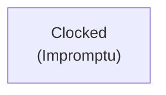
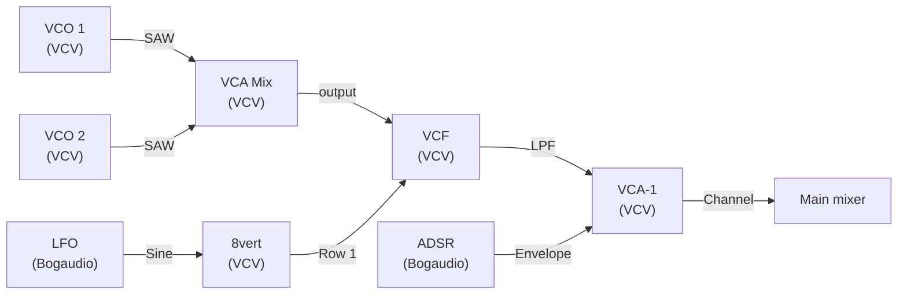
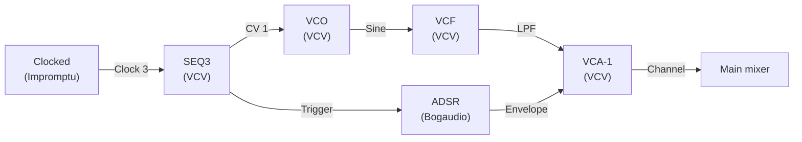
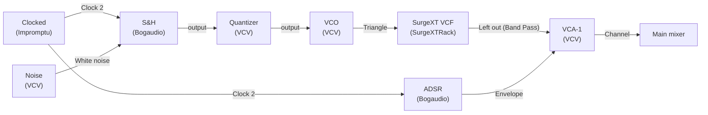
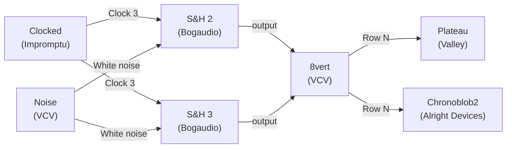
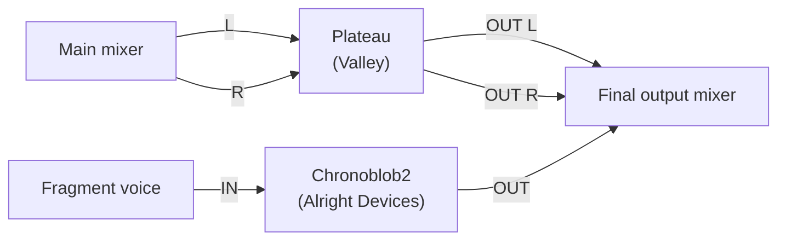

# Slow Psybient

This tutorial teaches the techniques behind slow, psychedelic dub-ambient music in the style of Younger Brother, Shpongle, and Ott. The reference is a track at approximately 89 BPM in G minor with a hypnotic half-time groove, slowly evolving textures, and enormous reverb tails. You are not recreating the track note for note — you are learning the building blocks: drone pad, sparse bass, psychedelic melodic fragments, half-time drums, and a slow modulation system that keeps everything moving.

Work through each section in order. Build it, listen to it, tweak it, then add the next layer. Do not try to build everything at once before listening.

## Plugins to install

Install these free plugins from the VCV Library before starting:

- **Bogaudio** — LFO, S&H, ADSR, VCO
- **Impromptu Modular** — Clocked (master clock)
- **Valley** — Plateau (reverb)
- **Alright Devices** — Chronoblob2 (delay)

## Part 1 — Clock

Add **Clocked (Impromptu)**. Set BPM to 89. Set **Clock 1** to ×1 (quarter notes), **Clock 2** to ×2 (eighth notes), **Clock 3** to /2 (half notes = one pulse every two beats).

Press RUN. The clock runs; nothing sounds yet.

**[⬇ Download patch — Part 1](slow-psybient-part1.vcv)**

## Part 2 — Drone Pad

The drone pad is the harmonic foundation. It plays continuously throughout the track, very slowly evolving in brightness and texture.

**Modules needed:** 2× VCO (VCV), VCF (VCV), VCA-1 (VCV), ADSR (Bogaudio), LFO (Bogaudio), 8vert (VCV), VCA Mix (VCV).

**Build it:**

1. Add two VCO modules. Set both to SAW output.
2. Set one VCO **FREQ** knob to G2 (approximately 98 Hz shown on the display). Set the other VCO **FREQ** to the same pitch, then nudge its **FREQ** knob by the smallest perceptible amount until you hear slow amplitude beating between the two oscillators. Tune by ear — faster beating = more detuning, slower beating = less. There is no FINE knob on VCV VCO.
3. Connect both SAW outputs to a VCA Mix (VCV) — its per-channel level knobs let you balance the two oscillators. Set both channel levels to about −4 dB each.
4. Connect the VCA Mix **Mix** output to VCF **IN** input. Set VCF **Cutoff frequency** to about 600 Hz, **Resonance** at 20%.
5. Add ADSR (Bogaudio). Set: Attack 4 s, Decay 0 s, Sustain 100%, Release 8 s. (Bogaudio ADSR shows attack/decay/release in seconds.)
6. Manually trigger the ADSR once (right-click → trigger) or patch a manual gate. The pad fades in slowly.
7. Connect ADSR **Envelope** output to VCA **CV** input. Connect VCF **LPF** output to VCA **Channel** input. Connect VCA **Channel** output to your main mixer.

**Listen:** You should hear a slowly swelling detuned saw pad in G. The detuning produces slow beating — the two oscillators drifting in and out of phase.

**Add filter motion:**

8. Add LFO (Bogaudio). Enable the **Slow** button (rates below ~0.064 Hz require Slow mode). Set FREQ to 0.05 Hz (one cycle every 20 seconds).
9. Take LFO (Bogaudio)'s **Sine** output to an **8vert** (VCV) **Row 1** input. Set the knob to +30%.
10. Connect the attenuated output to VCF **Frequency** CV input.

**Listen:** The filter now slowly opens and closes every 20 seconds. The pad breathes.

**Tweak:** Increase LFO rate to 0.1 Hz for faster breathing. Reduce 8vert attenuation to tighten the sweep range.

**[⬇ Download patch — Part 2](slow-psybient-part2.vcv)**

## Part 3 — Sparse Bass

The bass is simple, mono, and low. It sits below the pad and pulses on specific notes without constant movement.

**Modules needed:** VCO (VCV), VCF (VCV), VCA-1 (VCV), ADSR (Bogaudio), SEQ3 (VCV).

**Build it:**

1. Add SEQ3 (VCV). Connect Clocked **Clock 3** (half notes) to SEQ3's **Clock** input. Set STEPS to 5.
2. Set the five step voltages to approximately: G1, G1, F1, G1, Eb1 (relative to C4 = 0 V: G1 ≈ −2.42 V, F1 ≈ −2.58 V, Eb1 ≈ −2.75 V — tune by ear).
3. Enable gates on steps 1 and 3; leave 2, 4, 5 silent for sparse rhythm.
4. Add VCO. Set to Sine output for a clean bass tone. Connect SEQ3's **CV 1** output to VCO V/OCT.
5. VCO **Sine** → VCF **IN** input. Set VCF **Cutoff frequency** to 150 Hz, **Resonance** near 0%. VCF **LPF** output → VCA **Channel** input.
6. Add ADSR (Bogaudio). Attack 0.01 s (10 ms), Decay 0.4 s (400 ms), Sustain 0%, Release 0.1 s (100 ms). Connect SEQ3's **Trigger** output to ADSR **Gate** input. Connect ADSR **Envelope** output to VCA **CV** input.
7. Connect VCA **Channel** output to main mixer at a low level — the bass should support, not dominate.

**Listen:** You should hear a pulsing bass note following the G minor pattern.

**Tweak:** Enable or disable individual step gates to change the rhythm. The sparser the bass, the more hypnotic the groove.

**[⬇ Download patch — Part 3](slow-psybient-part3.vcv)**

## Part 4 — Psychedelic Fragments

Brief, bright melodic fragments that appear and disappear — the "psychedelic" element. These use random pitch selection with a quantizer so they always sound musical.

**Modules needed:** VCO (VCV) (or Wavetable VCO), VCF (SurgeXT VCF, SurgeXTRack), VCA-1 (VCV), ADSR (Bogaudio), S&H (Bogaudio), Noise (VCV), Quantizer (VCV), 8vert (VCV).

**Build it:**

1. Add S&H (Bogaudio). Connect Noise (VCV) **White noise** output to S&H **Signal 1** input. Connect Clocked **Clock 2** (eighth notes) to S&H **Trigger 1** input.
2. Add Quantizer (VCV). Select G minor scale: G, A, Bb, C, D, Eb, F.
3. Connect S&H output through Quantizer IN. Connect Quantizer OUT to a VCO V/OCT input.
4. VCO (set to **Triangle** output for a softer character) → **SurgeXT VCF** (SurgeXTRack): set its **Filter Model Type** knob to **Band Pass 12 dB**, **Frequency** at 1.5 kHz, **Resonance** at 40%. Patch the VCO into the SurgeXT VCF **Left** input and take its **Left** output → VCA.

   > *Better choice: **SurgeXT VCF** (SurgeXTRack) has a true band-pass mode. VCV VCF has only LPF and HPF outputs — it cannot do bandpass.*
5. Add ADSR (Bogaudio). Attack 0.005 s (5 ms), Decay 0.3 s (300 ms), Sustain 0%, Release 0.2 s (200 ms). Clock-trigger this ADSR from Clocked **Clock 2** as well.
6. Connect ADSR **Envelope** output to VCA **CV** input. VCA **Channel** output → main mixer at a low level — these should be subtle, not prominent.

**Listen:** You should now hear sparse random notes in G minor appearing on eighth notes. The triangle wave through the filter gives them a nasal, distant character.

**Tweak:** Reduce Clocked **Clock 2** to **Clock 3** (half notes) to make fragments appear less frequently. This is usually better — too many notes sound like a melody rather than a texture.

**[⬇ Download patch — Part 4](slow-psybient-part4.vcv)**

## Part 5 — Half-Time Drums

89 BPM half-time feel: kick on beats 1 and 3, snare on beat 3, closed hats on eighth notes.

**Modules needed:** Noise (VCV) (×2 or one shared), 3× VCA-1 (VCV), 3× ADSR (Bogaudio), VCA Mix (VCV), Clocked (Impromptu) (already running).

For authentic drums you would use a dedicated drum module like Valley Topograph. For this tutorial, build simple noise bursts:

**Kick:**
1. Noise White → VCF (**Cutoff frequency** 80 Hz, **Resonance** 10%, LPF output) → VCA.
2. ADSR: Attack 0.002 s (2 ms), Decay 0.08 s (80 ms), Sustain 0%, Release 0.05 s (50 ms). Trigger from a trigger pattern. For a half-time kick: use SEQ3 (VCV) with Clocked **Clock 1** (quarter notes), 4 steps, gates on steps 1 and 3 only.
3. VCA **Channel** output → drum mixer.

**Snare:**
1. Noise White → VCA (no filter needed).
2. ADSR: Attack 0.001 s (1 ms), Decay 0.12 s (120 ms), Sustain 0%, Release 0.06 s (60 ms). Trigger from SEQ3 step 3 only.
3. VCA **Channel** output → drum mixer.

**Hi-hats:**
1. Noise White → VCF (**Cutoff frequency** 8 kHz, HPF output) → VCA.
2. ADSR: Attack 0.001 s (1 ms), Decay 0.04 s (40 ms), Sustain 0%, Release 0.02 s (20 ms). Trigger from Clocked **Clock 2** (eighth notes).
3. VCA **Channel** output → drum mixer at low level.

**Listen:** You should have a sparse, half-time groove. The kick and snare are the skeleton; hats add motion.

**[⬇ Download patch — Part 5](slow-psybient-part5.vcv)**

## Part 6 — The Slow Modulation System

This is what makes the patch feel alive and psychedelic rather than mechanical. Add multiple ultra-slow modulators targeting different parameters simultaneously.

**Add three more LFO (Bogaudio) modules:**

**LFO A — pad filter drift (already built in Part 2):** 0.05 Hz sine to VCF **Frequency** CV input of the pad.

**LFO B — fine pitch drift:**
1. Add LFO (Bogaudio). Enable the **Slow** button (0.03 Hz is below the normal-mode minimum). Set FREQ to 0.03 Hz (one cycle every 33 seconds).
2. Take **Sine** output through **8vert** (VCV) **Row 1** input at very low attenuation (5% — tiny amount).
3. Connect to both pad VCO modules' FM inputs. This causes the pitch to drift imperceptibly — you feel it more than hear it.

**LFO C — fragment density:**
1. Add LFO (Bogaudio). Enable the **Slow** button. Set FREQ to 0.08 Hz.
2. Take **Sine** output through **8vert** (VCV) **Row 2** input at 40%.
3. Connect to the fragment VCA's **CV** input as an offset. This makes the fragments gradually louder and quieter over a ~12.5-second cycle.

**S&H into reverb and delay:**
1. Add a second S&H (Bogaudio). **Signal 1** input: Noise (VCV) **White noise** output. **Trigger 1**: Clocked **Clock 3** (one pulse every two beats).
2. Connect S&H output through **8vert** (VCV) **Row 3** input (30%) to Plateau's DECAY CV input.
3. Add a third S&H (Bogaudio). **Signal 1** input: Noise (VCV) **White noise** output. **Trigger 1**: Clocked **Clock 3**.
4. Connect S&H output through **8vert** (VCV) **Row 4** input (20%) to Chronoblob2's FEEDBACK CV input.

The reverb decay and delay feedback now change randomly every two beats — the reverb tail gets longer and shorter organically, and the delay becomes denser and sparser unpredictably.

**Listen:** The patch should now sound like it has a life of its own. Nothing repeats exactly.

**[⬇ Download patch — Part 6](slow-psybient-part6.vcv)**

## Part 7 — Effects Chain

The effects are what give this style its enormous spatial quality.

**Add Plateau (Valley):**
1. Take the main drum + bass + fragment mixer output to Plateau L input (connect same signal to R for mono-to-stereo).
2. Settings: SIZE 0.9, DIFF 0.7, DECAY 0.92, DAMP 0.35, MOD SPEED 0.2, MOD DEPTH 0.15, PRE-DELAY 0.3 (20–30ms equivalent).
3. Connect Plateau OUT L+R to the final output mixer at 0.4 (below the dry signal level).

**Add Chronoblob2 (Alright Devices):**
1. Route the fragment voice (before it hits the main mixer) to Chronoblob2 IN.
2. Settings: TIME at dotted 1/8 (at 89 BPM ≈ 505 ms), FEEDBACK 0.5, TONE 0.35, MIX 0.45.
3. Connect Chronoblob2 OUT to the final mixer alongside the dry fragment signal.

**Listen:** You should now hear the patch transform into a spatial, immersive texture — the enormous Plateau reverb and dub-style Chronoblob delay place every sound inside a large, living space.

**[⬇ Download patch — Part 7](slow-psybient-part7.vcv)**

## Part 8 — Mixing

Final balance guidelines:

- Pad: prominent but not harsh. Sits in the mid-range.
- Bass: felt more than heard. Low in the mix.
- Fragments: at most 30% of the pad level. Background element.
- Drums: kick solid, snare present, hats subtle.
- Reverb return: generously loud — this style has wet reverb in the foreground, not the background.
- Delay return: moderate — delay echoes should be heard, not overpowering.

Roll off high frequencies by running the main bus through a VCF on its Lowpass (LPF) output with the cutoff set around 12 kHz. Psybient mixes are typically dark and warm.

You should now hear the same sounds as Part 7, but better balanced — pad prominent but not harsh, reverb generous and forward in the mix, bass felt more than heard, fragments subtle.

**[⬇ Download patch — Part 8](slow-psybient-part8.vcv)**

## Key style rules

1. Less is more. Sparse bass and sparse melodic fragments feel more hypnotic than busy ones.
2. The modulation system matters more than the notes. Change LFO rates to change the feel entirely.
3. Reverb can be as loud as the dry signal in this style — don't be afraid of wet.
4. Add micro-changes every 4–8 bars. Mute a layer, change a sequencer step, open a filter by hand.
5. The patch should feel like it could run for an hour without repeating exactly.

## Where to go next

- [LFO](lfo.md) — deeper understanding of the modulation techniques used here
- [Sample & Hold](sample-hold.md) — S&H applications beyond this patch
- [Delay, Reverb & Chorus](delay-reverb-chorus.md) — Plateau and Chronoblob in detail
- [Patching Use Cases](patching-use-cases.md) — other patching styles to explore

---
*Version: 2026-06-19.*
